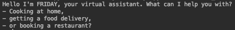

In the Avengers saga, Tony Stark utilises a number of AI powered assistants to try and *create a suit or armour around the world*. His most recent assistant is [F.R.I.D.A.Y.](https://ironman.fandom.com/wiki/F.R.I.D.A.Y.), in this article will use the [speech_recognition](https://pypi.org/project/SpeechRecognition/) library to scaffold our own virtual assistant. We will also be using the selenium web browser module to give our chatbot some previewed wisdom. An earlier implementation is aviablable in full [here](https://github.com/Quotennial/Jarvis-Like-Bot/blob/master/Jarvis.py). This article will run through the main features and layout of the program. 

# A Tour of the Program

The program is written in python to help with evening meal plans, it is voice activated apart from the “Food for delivery” function. The program starts with the options menu:




## Cooking at home

Even the genocidal warlord from titan enjoys some home-cooking looking over a grateful universe. Using the voice command *"cooking at home"*, FRIDAY will ask you for some ingredients, after you've said what ingredients you have in stock, the program will use selenium to search and return the best recipes for your ingredients.


The code uses selenium to open the website https://recipeland.com and enters the terms in the search box before searching and parsing the top 3 results and outputting the results.

```python
def search_recipe(search_term, num_results=3):
    
    #Open the website using Chrome
    url ="https://recipeland.com/recipes/by_ingredient"
    chromedriver = "/Users/yusufsohoye/pythoncode/chromedriver"
    driver =  webdriver.Chrome(chromedriver)
    driver.get(url)
    
    #Search for the ingredients 
    search_box=driver.find_element_by_id("recipes-by-ingredients")
    search_box.send_keys(search_term)
    search_box.submit
    search_box.send_keys(u'\ue007')
    
    #Save the results
    links = driver.find_elements_by_xpath("//h2//a")
    results =[]
    for link in links[:num_results]:
        #Print the title and the link
        title = link.get_attribute("title")
        href = link.get_attribute("href")
        print(title)
        print(href)
        results.append(href)
    return results
```

## Restaurant

​								 

Sometimes we might fancy eating out, F.R.I.D.A.Y. can help with that too! Just use the voice command *"book a restaurant"* and your browser will direct to a selection of restaurants in your chosen area.


The browser uses your stated  location, in this case London, and searches the yelp page to provide you with the recommendations. 


## Program Layout

As mentioned, the full code can be found on the GitHub [repo](https://github.com/Quotennial/Jarvis-Like-Bot/blob/master/Jarvis.py), we start the program by listening for our users input. After that the string in the `f.recognize_google(audio)` variable is used to determine the next steps. Looking for key words such as "home", "restaurant", "delivery" and "bye" to direct to certain functions.

```python
# The first selection menu
f = sRec.Recognizer()
with sRec.Microphone() as source:
    print("""Hello I'm FRIDAY, your virtual assistant. What can I help you with?
- Cooking at home,
- getting a food delivery,
- or booking a restaurant?""")
    audio = f.listen(source)
    print(f.recognize_google(audio))
```

# Closing Down

As with any great hero story, there is an end. When you're finished with your new virtual assistant just say a friendly bye. 

