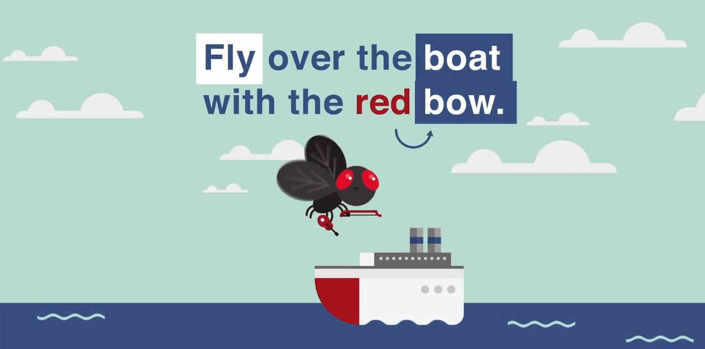
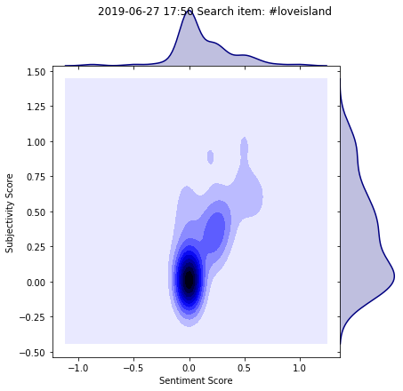
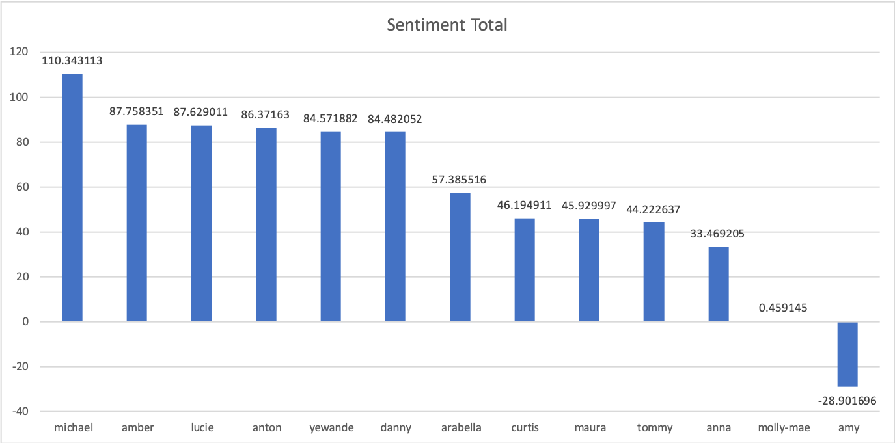
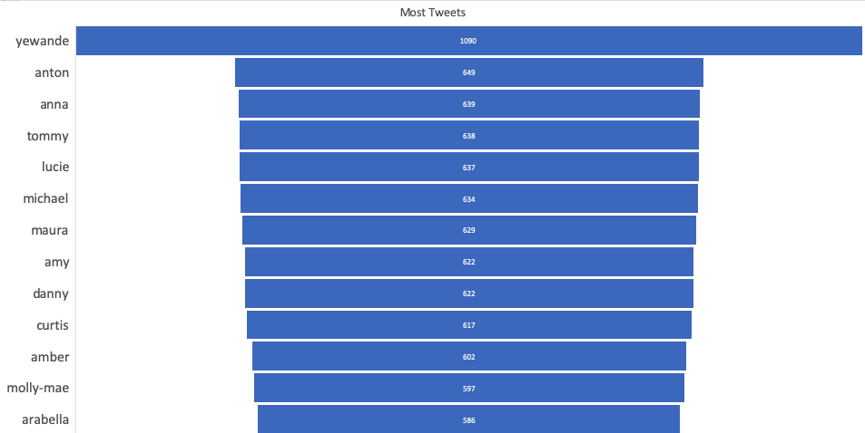
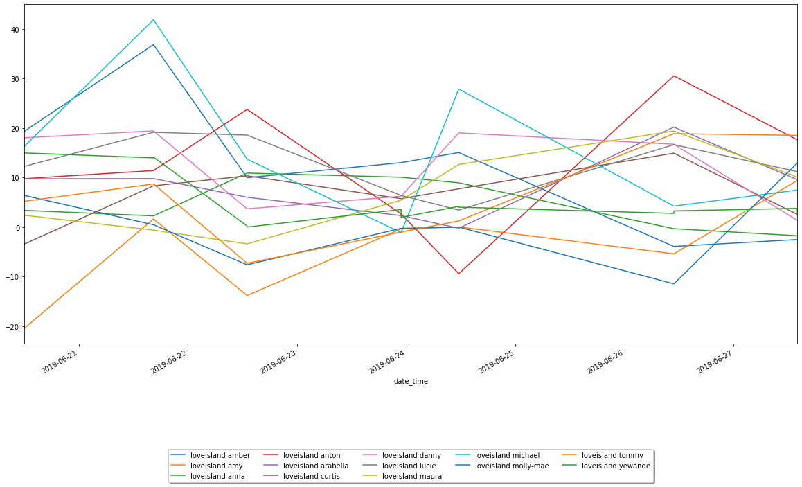
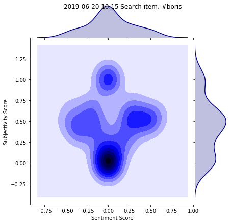

This article will look at the twittersphere in relation to this year's Love Island series. If you want to skip straight to the Love Island results, feel free to do so using the contents navigator. In this article we will use the Twitter API to gauge sentiment about Love Island contestants. In addition we will also use [TextBlob](https://textblob.readthedocs.io/en/dev/quickstart.html) to parse our selected tweets and use the natural language processing tools in the package.

Firstly let's import the packages we will be using including some visualisation libraries. 

```python
import tweepy
from textblob import TextBlob
import numpy as np
import matplotlib.pyplot as plt
import seaborn as sns
import datetime
```

# Twitter API

To make use of the twitter API, you must register a developer account which can be linked to your personal account. To do so use this [link](https://apps.twitter.com/) and follow the instructions. The process shouldn't take too long. After you have successfully registered, we need to define our API Keys:

```python
# Define API keys
consumer_key = 'your-consumer_key'
consumer_secret = 'your-consumer_secret'
access_token = 'your-access_token'
access_token_secret = 'your-access_token_secret'
```

and authenticate our connection to the API:

```python
# Authenticate your application
auth = tweepy.OAuthHandler(consumer_key, consumer_secret)
auth.set_access_token(access_token, access_token_secret)
api = tweepy.API(auth)
```

Now that we have successfully connected to the twitter API, we are ready to collect some tweets. 

# Sentiment Analysis

Before we start asking Twitter for some some tweets, let's first talk about what sentiment analysis is. Sentiment analysis is part of the broader Natural Language Processing tools. Since language is tricky for for computers - words have many meanings and sarcasm is hard to pick up across text, therefore context is often key. These issues are illustrated in the example below:



This example could be an instruction to fly (verb) over the boat, or it could be a description of a fly (noun) over the boat. In addition, it could mean that the boat has a red front part (bow), or it might be that the fly has a red accessory with which he can play the violin (bow).

This rather obscure example is for illustrative purposes, but complicated semantics occur in everyday text on a regular basis.

# Bag of words method

## Tokenisation

One approach to managing text is the bag of words method. The **bag of words** method starts by accessing all the words in a piece of text, removing grammar and disregarding word order. This is in the tokenisation stage. We can take the lyrics from Nina Simone's seminal classic *Feeling Good*

```python
lyrics = TextBlob("""Birds flying high, you know how I feel.
Sun in the sky, you know how I feel.""")
lyrics.words
```

Our TextBlob library very helpfully splits the words into individual 'tokens' for us to use:

```
WordList(['Birds', 'flying', 'high', 'you', 'know', 'how', 'I', 'feel', 'Sun', 'in', 'the', 'sky', 'you', 'know', 'how', 'I', 'feel'])
```

After these tokens are split, we can use  speech tagging methods to get a better sense of the composition of the sentence:

```python
lyrics.tags
```

```
[('Birds', 'NNS'),
 ('flying', 'VBG'),
 ('high', 'JJ'),
 ('you', 'PRP'),
 ('know', 'VBP'),
 ('how', 'WRB'),
 ('I', 'PRP'),
 ('feel', 'VBP'),
 ('Sun', 'NNP'),
 ('in', 'IN'),
 ('the', 'DT'),
 ('sky', 'NN'),
 ('you', 'PRP'),
 ('know', 'VBP'),
 ('how', 'WRB'),
 ('I', 'PRP'),
 ('feel', 'VBP')]
```

These tags are able to classify the individual tokens, for example: Noun Plural (NNS), Adjective (JJ) and others, full list available [here](https://blog.thedigitalgroup.com/assets/uploads/POS-Tags.png). Now we can begin to do many things, like remove "stop words" which are words such as   “the”, “a”, “an”, “in”. These don't offer any new information and take up space.

## Stemming and Lemmatisation

We can also use stemming and lemmatisation to get all possible versions of the word. Stemming works by cutting off the end or the beginning of the word, taking into account a list of common prefixes and suffixes that can be found in an inflected word.

| Word     | Stem  |
| -------- | ----- |
| Studies  | Studi |
| Studying | Study |

Lemitisation  takes into consideration the morphological analysis of the words. 

| Word     | Lemma |
| -------- | ----- |
| Studies  | Study |
| Studying | Study |

## Sentiment

In simple terms, sentiment analysis is used to find the author’s attitude towards something. Tools aim to categorise pieces of text as positive, neutral, or negative. Sentiment analysis utilises tokenisation and algorithms designed to identify positive and negative words to gain the overall text sentiment. 

> I ***hate*** liars so much Tom needs to go 😡 #LoveIsland 

The above tweet was given a polarity score of -0.30000000000000004, negative number signifying negative sentiment on a scale of -1 to +1. 

TextBlob is one implementation of Natural Language Processing and is built on the Natural Language Toolkit [library](http://www.nltk.org). If you would like to know more about natural language processing, [this article](https://medium.com/@ageitgey/natural-language-processing-is-fun-9a0bff37854e) is a good place to start.

# TextBlob

The library we will use for Natural Language processing in python is the TextBlob package. The TextBlob documentation provides some useful code examples with many more elsewhere online. We are able to write a function to get the sentiment scores from a string. The input will be tweets for us.

```python
def get_sentiment_scores(search_string):
    '''Takes in twitter search term, outputs array in the format:
     [ [sentiment_score],[subjectivity_score] ]'''
    sent_for_term = []
    subj_for_term = []
    # Use tweepy to search the string, returns 100 score pairs
    public_tweets = api.search(q=search_string, count=100)

    for tweet in public_tweets:
        # TextBlob returns tuple
        analysis = TextBlob(tweet.text)
        # Store the sentiment and subjectivity scores
        sent_for_term.append(analysis.sentiment[0])
        subj_for_term.append(analysis.sentiment[1])

    score_collect = ([sent_for_term, subj_for_term])
    return (score_collect)
```

The search string is the term we're looking for. It would be the term you would type into the Twitter search bar on the web client. The `public_tweets` variable holds 100 tweets and the corresponding metadata: very messy. So we use TextBlob (which has it's own twitter methods) to parse these messy tweets into what we want, the `tweet.text`! Now we have the text, we use the TextBlob sentiment method to get the sentiment and subjectivity of each tweet. 

## Plotting

To plot our results we may use the seaborn joint plot, which will allow us to plot sentiment against subjectivity. This will allow us to retrieve and plot the sentiment scores against the subjectivity scores. This function calls the previous `get_sentiment_scores` function to get the sentiment scores and then plot it.

```python
    '''Takes search terms, passed to obtain scores, then prints a joint plot'''
    for item in search_terms:
        # Call to the function to query tweepy and store the scores
        scores = get_sentiment_scores(item)
        # Zip the sentiment and subjectivity ready to plot
        x_coords, y_coords = zip(np.array(scores))

        h = sns.jointplot(x_coords, y_coords, kind="kde", space=0, color="navy")
        h.ax_joint.set_xlabel('Sentiment Score')
        h.ax_joint.set_ylabel('Subjectivity Score')
        h.fig.suptitle(f'{now.strftime("%Y-%m-%d %H:%M")} Search item: {item}')
        plt.show()
```

Using the `print_analysis` function we are able to pass in a search term gathering the top 100 tweets containing that term. 

```python
print_analysis("#loveisland")
```



As the figure shows, there is a positive sentiment relating to the show. Lots of excitement, however the classification also provides the subjectivity score. We can see the more extreme the sentiment scores, the more subjective a tweet is likely to be. These are the tweets in the top right of the figure. This passes the common sense test. As we use more excitable language we may stray from strictly the facts and use language to express how we feel.

# Regular Sentiment Checker

By altering the `print_analysis` function to store the sentiment scores, we are able to track sentiment through time. The function now appends the sentiment scores to a csv file. 

```python
def append_analysis(*search_terms):
    '''Takes search terms, passed to obtain scores, then prints a joint plot'''
    for item in search_terms:
        # Call to the function to query tweepy and store the scores
        scores = get_sentiment_scores(item)
        append_list = scores[0]
        #append the info at the start
        append_list.insert(0,now.strftime("%Y-%m-%d %H:%M"))
        append_list.insert(0,item)
        with open('loveisland_sentiment.csv', 'a') as csvFile:
            writer = csv.writer(csvFile)
            writer.writerow(append_list)
    csvFile.close()
```

We can loop through the list of names currently in the villa. 

# Love Island Results


Finally, using the methods above, we are able to iterate through tweets mentioning each individual islander to get the sentiment scores from the twittersphere. The programme was run around midday every day. This was done in order to get a more representative sample as twists and turns of each episode may skew the tweets if scraping was done during the episode.  

We also use sentiment totals rather than the average sentiment as we want to obtain a magnitude score. The average will standardise the result, summing the total would mean if there are more people tweeting then we can see a larger sentiment score (either positive or negative). If people were feeling really positive about someone, then more people would be tweeting about them leading to a higher score, taking the mean sentiment values would lose this characteristic that implicitly measures the number of tweets mentioning about the individual islander.

## Total Sentiment

This total score was calculated for the period 20/06 -27/06. The 



As shown, Michael is by far an away the most popular islander over the course of the week. 


## Most Talked about Islander



No competition, Yewande is very much the front runner in this, considering she hasn't been on the island for the whole duration of the data set this is very impressive. At the other end of the table, Arabella has the fewest mentions. However, domain knowledge informs me many on Twitter use a large variety of aliases instead of her real name. Here's Yewande walking to the top of the mentions:


## Sentiment Over Time




This may look like a muddle of squiggles, but if you pick out an islander you can follow their journey though the public's opinion. For example our favourite man Micheal starts strong and continues to have spikes throughout the week. Whereas Maura in the light green, starts off negative and picks up as the week goes on. Maybe you can pinpoint moments throughout the week to explain these dips and peaks in sentiment scores?

Thanks for reading, I hope this has been a helpful introduction into tweepy and sentiment analysis. If you did enjoy the Love Island theme or have any other thoughts then please let me know!

# P.S. - More Serious Application

The same methods can be applied to politics and brand management. To be able to access the general publics sentiment about your product is a key tool in the armoury for these organisations.

```python
print_analysis("#boris")
```

​								 

Using our `print_analysis` function we are able to search the  top 100 tweets using the #boris, and the joint plot uncovers some interesting results. The bottom dark blue spot indicates a fairly neutral tweet, we can interpret this as fact based, maybe news reports and updates. As the subjectivity increases we can see the sentiment splits, these more opinion based tweets can give us an insight into how the twittersphere is feeling about this British prime ministerial candidate. 

