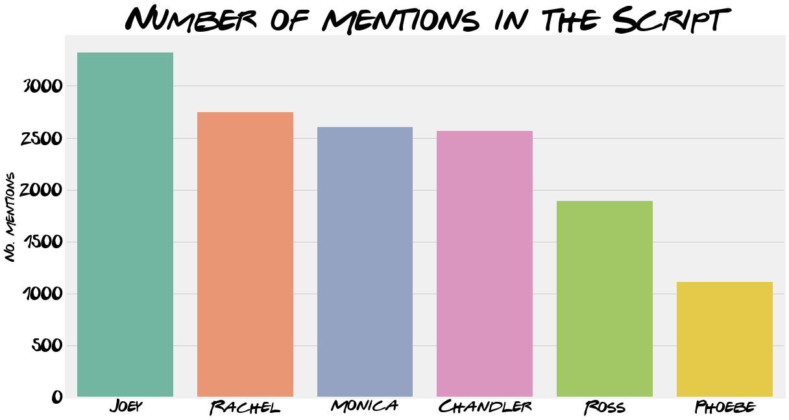

Better intro needed

This article will use the data collected in a [previous post](https://quotennial.github.io/friends-engineering/) to analyse the T.V.show FRIENDS. It has been a really enjoyable hobby projected one I have been wanting to do for a while. Hopefully it provides an alternative look at the most looked-at show. As always, feel free to skip the coding bits and jump to the visualisations, hope you enjoy!

# The Most Popular Friend

This section looks at each character's role in the show. The previous post walked through the process of putting the data into a SQL database. This was in order to make a query like "who had the most number of lines during the whole show" fairly simple:

```sql
SELECT char, COUNT(line) AS 'spoken_lines'
FROM lines
GROUP BY  char
ORDER  BY spoken_lines DESC
```

{: .align-center}

Rachel just scrapes the top spot with 9294 lines over the entire series Ross coming in a very close second (9070), both averaging around 39-ish lines per episode. This isn't entirely a shock, as they were both the main plot throughout 10 seasons. Almost inseparable are Monica and Chandler, 8403 and 8398 respectively. A look at the number of lines breakdown throughout the series confirms this pattern, we can see Ross and Rachel dominating the lines until around Season 4. This is when the London episodes happen and Chandler and Monica have a bigger joint story, translating in more lines. 


## Most Spoken About

Was tough because of nicknames 

```python
nicknames = [['Rachel', 'Rach'], 
             ['Ross', 'Ross-A-Tron', 'Professor Geller'], 
             ['Monica', 'Mon'],
             ['Chandler', 'Chan'],
             ['Joey', 'Joe'], 
             ['Phoebe', 'Phoebes','Phoebs']]
```



# Catchphrases

how you doin

we were on a break

smelly cat

## Largest Vocabulary 

{: .align-center}

```sql
SELECT char, line
FROM lines
WHERE char IN ('Rachel', 'Ross', 'Monica','Chandler','Joey', 'Phoebe')
```

Another interesting aspect to look at is the lexicon of words each character uses. This is done by first selecting all the lines said by the  main characters as shown above. After which all non alphabetical characters are removed. Every line by each characters is then split into words (using the space in between to split) and added to a set. A set allows no repeated values which is perfect for our use in this case.

```python
# function to remove all non alphabetical characters keep spaces
def alphanumonly(text):
    '''Remove all non letters from string'''
    regex = re.compile('[^a-zA-Z ]')
    #First parameter is the replacement, second parameter is your input string
    return(regex.sub('', text))
```

Unsurprisingly Ross tops the list his passion for dinosaurs is a running joke throughout the series. Despite his career, starting off at the New York Museum of Prehistoric History and then professor at New York University, some real-life paleontologists [aren't convinced](https://redditblog.com/2015/10/24/an-actual-paleontologist-grades-friends-paleontologist-ross-gellar/). I'm sure I'm not the only one surprised to see Joey in not-last-place. Given the role's stereotypical caricature it appears Joey does have a couple of words up his sleeve, even if they are made up!


# How you Doin'?

## Ross and Rachel

<div class="iactiveImg" data-ii="7508"></div><script src="https://interactive-img.com/js/include.js"></script>
# Networks

Do mention each other, then can speak about nicknames etc.


Then move onto network analysis 


Really interesting use of eigenvalues, speak about how it doesn't mention the most popular character but who the most populate character speaks to.

| Scores   |          |
| -------- | -------- |
| Joey     | 0.549413 |
| Chandler | 0.443715 |
| Monica   | 0.427912 |
| Rachel   | 0.420983 |
| Ross     | 0.326894 |
| Phoebe   | 0.184572 |

