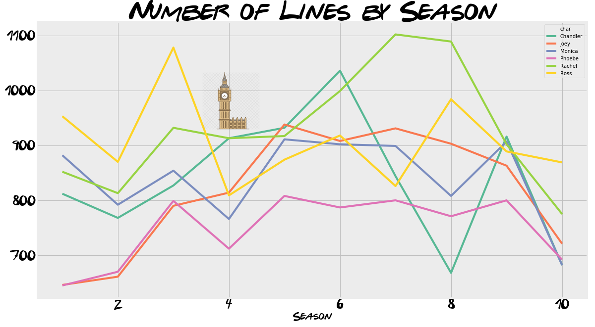
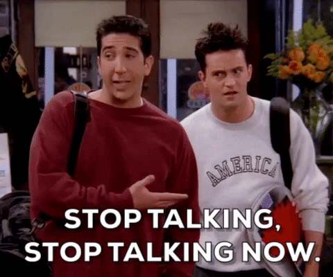
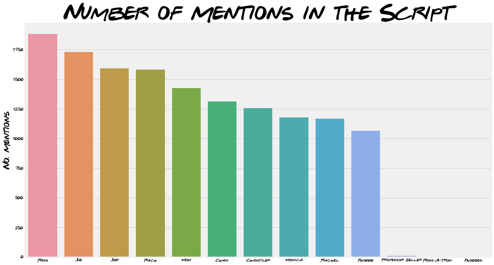
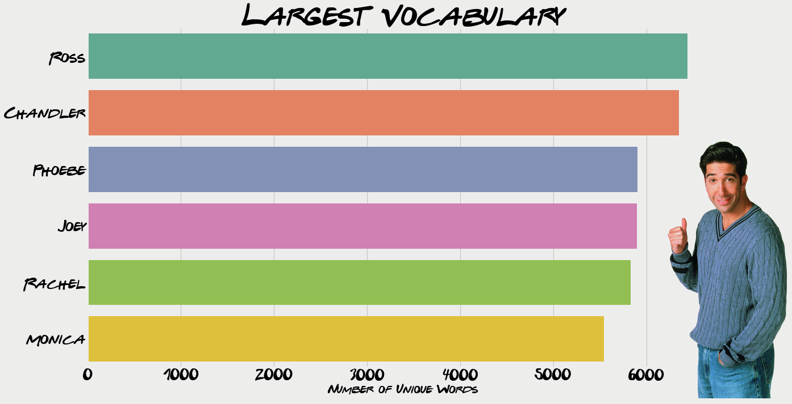
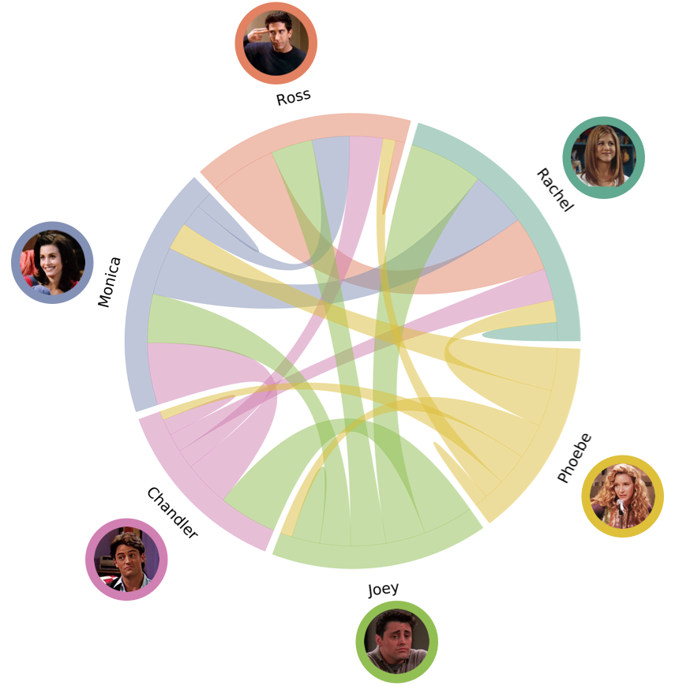

FRIENDS is one of my favourite shows (probably *the* favourite) and I'm sure I'm not alone in having rewatched the entire series more than once. This post aims to provide some interesting findings about the characters we know so well, some expected and some surprising results ahead! We will use the data collected in a [previous post](https://quotennial.github.io/friends-engineering/) to analyse the T.V. show. It has been a really enjoyable hobby project and one I have been wanting to do for a while. Hopefully it provides an alternative look at the most looked-at show. As always, feel free to skip the coding bits and jump to the visualisations, hope you enjoy it!


# The Most Popular Friend

This section looks at each character's role in the show. The previous post walked through the process of putting the data into a SQL database. This was in order to make a query like "who had the most number of lines during the whole series" fairly simple:

```sql
SELECT char, COUNT(line) AS 'spoken_lines'
FROM lines
GROUP BY  char
ORDER  BY spoken_lines DESC
```

{: .align-center}

Rachel just edges the top spot with 9294 lines over the entire series Ross coming in a very close second (9070), both averaging around 39-ish lines per episode. This isn't entirely a shock, as they were both the main plot throughout 10 seasons. Almost inseparable are Monica and Chandler, 8403 and 8398 respectively. 

```sql
/*number of lines per season*/ 
SELECT char, season,  count(line) AS total_lines
FROM lines
WHERE char IN ('Rachel', 'Ross', 'Monica','Chandler','Joey', 'Phoebe') 
GROUP BY season, char
```



A look at the number of lines breakdown throughout the series confirms this pattern, we can see Ross and Rachel dominating the lines until around Season 4. This is when the London episodes happen and Chandler and Monica have a bigger joint story, translating in more lines. I think it is a shame Phoebe never got more lines, staying rooted at around 800 lines per season. Rachel did say it:

> *Ugh, it was just a matter of time before someone had to leave the group. I just always assumed Phoebe would be the one to go.* - Rachel 5.05

## Most Spoken About



Being the one doing the most talking does not necessarily mean you're the most popular, so now we will take a look at who's talked about the most. This is a pretty difficult task to accurately capture all mentions of each character. A possible solution is a list of nicknames for each character (let me know if I have missed any out!). It's pertinent to note, this is the method we will use to find any reference to each character throughout this post, using the nicknames detailed below.

```python
nicknames = [['Rachel', 'Rach'], 
             ['Ross', 'Ross-A-Tron', 'Professor Geller'], 
             ['Monica', 'Mon'],
             ['Chandler', 'Chan'],
             ['Joey', 'Joe'], 
             ['Phoebe', 'Phoebes']]
```

In order to get the count, we first iterate through the characters, keeping a count of the mentions. Using a nested for-loop to get each characters nickname, we use the pandas `count()` method to keep a tally of the number of mentions. 

```python
# SQL query to get all lines
all_lines = pd.read_sql("""
SELECT line
FROM lines""", conn)

char_mention = [] # list to hold the character mention totals


for name_list in nicknames:    # loop for each character
    mention_counter = 0        # keep track of the mentions
    for name in name_list:     # loop for each nickname
        mentions = all_lines['line'].str.count(name).sum()
        mention_counter += mentions
    char_mention.append([name_list[0], mention_counter]) #append the name and mention count
```


When using only full names, Ross is the most  mentioned.  "Chan", "Joe", "Mon" and "Rach" are all mentioned more than their full names. This supports the decision to include the nicknames but does also highlight how sensitive the results are to picking the right names.



# Words

## Catchphrases

There are a few running catchphrases, for example "Smelly Cat " was mentioned 37 times throughout the whole show. The infamous "We were on a break" line was referred to 17 times. And Joey's pick up line "How you doin'" was said 37 times. 

## Largest Vocabulary 

{: .align-center}

```sql
SELECT char, line
FROM lines
WHERE char IN ('Rachel', 'Ross', 'Monica','Chandler','Joey', 'Phoebe')
```

Another interesting aspect to look at is the lexicon of words each character uses. This is done by first selecting all the lines said by the  main characters as shown above. After which all non alphabetical characters are removed. Every line by each characters is then split into words (using the space in between to split) and added to a set. A set allows no repeated values which is perfect for our use in this case.

```python
# function to remove all non alphabetical characters keep spaces
def alphanumonly(text):
    '''Remove all non letters from string'''
    regex = re.compile('[^a-zA-Z ]')
    #First parameter is the replacement, second parameter is your input string
    return(regex.sub('', text))
```

Unsurprisingly Ross tops the list his passion for dinosaurs is a running joke throughout the series. Despite his career, starting off at the New York Museum of Prehistoric History and then professor at New York University, some real-life paleontologists [aren't convinced](https://redditblog.com/2015/10/24/an-actual-paleontologist-grades-friends-paleontologist-ross-gellar/). I'm sure I'm not the only one surprised to see Joey in not-last-place. Given the role's stereotypical caricature it appears Joey does have a couple of words up his sleeve, even if they are made up!




# How you Doin'?

## Ross and Rachel

As we have calculated a sentiment score for each line, we are able to monitor this score throughout the course of a season.

<div class="iactiveImg" data-ii="7508"></div><script src="https://interactive-img.com/js/include.js"></script>
The chart above shows tracks the sentiment for Rachel and Ross throughout the first 2 seasons. Total  sentiment score per episode is calculated, as the scores range in-between -1 to 1 the total will give an indication of the majority of sentiment throughout a particular episode.

# Networks

So far we have mostly looked at out FRIENDS isolation, here we will see how they interact. Looking at how many times a character mentions another characters name the show so we can draw networks relating each character to another. The table below shows the results; read from left to right tells us that Rachel mentioned herself 187 times and mentioned Joey the most: 739 times. Read from top to bottom can be understood as Rachel mentioned Chandler 321 times, Ross mentioned him 332 times and his wife (Monica) mentioned him the most: 622.

|              | Rachel | Ross | Monica | Chandler | Joey | Phoebe |
| ------------ | ------ | ---- | ------ | -------- | ---- | ------ |
| **Rachel**   | 187    | 550  | 566    | 321      | 739  | 222    |
| **Ross**     | 662    | 95   | 375    | 332      | 415  | 126    |
| **Monica**   | 482    | 226  | 171    | 622      | 487  | 275    |
| **Chandler** | 185    | 189  | 458    | 163      | 585  | 88     |
| **Joey**     | 398    | 353  | 306    | 502      | 282  | 119    |
| **Phoebe**   | 366    | 207  | 426    | 318      | 354  | 133    |

The table throws up some interesting findings, Rachel was mentioned the most by Ross (622, and one [cost him his marrige](https://youtu.be/5-1-W-qH6Fc?t=253) ) and Ross was mentioned by Rachel the most: 550. Interestingly, although Monica says chandler the most, Chandler says Joey the most.

{: .align-center}


The table does provide some insight but it isn't the most ascetically pleasing way to look at the findings. So we can create a chord diagram using [this fucntion](https://github.com/fengwangPhysics/matplotlib-chord-diagram/blob/master/matplotlib-chord.py) provided on Github. The size of the chords for each characters section represents how many times they said the connecting characters name.  In other words, if you were to read the values from left to right in the table, that is what each characters portion shows. This makes it clearer just how much both Joey and Monica occupy Chandler's mentions by looking at the pink slice.



## Graph and Centrality

So  we have now built a network of FRIENDS we can calculate a centrality score for each of them. Centrality aims to answer the question: *Who is the most important or central person in this network?*. Obviously this is a subjective question depending on the definition of importance. Before we define our measure of importance, we must first convert our table into a graph. We will use network x to create a directed, weighted graph using the values in the table above (stored in `network_data`). Nodes are the characters and the weights are the number of mentions. We can also check the graph has been created correctly by checking the edge weights between nodes.

```python
import networkx as nx
A = np.array(network_data) #turn the list of list into a numpy array
G = nx.DiGraph(A) #use a directed graph

mapping = {0:'Rachel', 1:'Ross', 2:'Monica',3:'Chandler',4:'Joey', 5:'Phoebe'}
H = nx.relabel_nodes(G, mapping) #relabel the nodes

H['Phoebe']['Monica'] #check the edge weight
```

```python
out: {'weight': 426} # yay! it matches our table
```

Now we have created our graph, we calculate the [Eigenvector Centrality](https://www.youtube.com/watch?v=9vs1zSqd070) as a measure of importance (used in Google's page rank). This algorithm aims quantify influence of people in a social network, based on connections with important people. In this case we are defining "importance" as connections with important people. With an emphasis on links with other people, it is easy to see how this may be applied to other larger networks such as Twitter. Using "interactions" (retweets and likes) as weights, this algorithm may be able to give you the most connected accounts in a network, potentially gaining more insight than a count of the highest number of followers. Valuable information for anyone looking to gauge (or alter) public opinion.

```python
# Compute the degree centrality of the Twitter network
cent_scores = nx.algorithms.centrality.eigenvector_centrality_numpy(H,weight='weight')
```

Networkx makes life easy, apply the `eigenvector_centrality_numpy` method and define the weights to calculate the scores for each node. The result in order of importance is shown below. I was surprised upon initially looking at the results, however when I thought about the measure it started to make sense. I think Joey could be seen as the glue of the group, always interacting with the other characters. To see Ross and Rachel at the lower end isn't entirely surprising given that they occupy most of each others time. This post hasn't been great for Phoebe 🙁​ .These results are subjective, as as is the interpretation and I would love to hear what you think about the centrality scores.

|  Scores  | Centrality Score |
| :------: | :--------------: |
|   Joey   |     0.549413     |
| Chandler |     0.443715     |
|  Monica  |     0.427912     |
|  Rachel  |     0.420983     |
|   Ross   |     0.326894     |
|  Phoebe  |     0.184572     |

I hope you enjoyed this alternative view on the popular show. Whilst I understand FRIENDS may not be everyone's cup of tea I do think this kind of analysis  can be applied to almost any long running series. Maybe you could try out something similar for your favourite show and let me know what you find! 


Thanks for reading 🙂