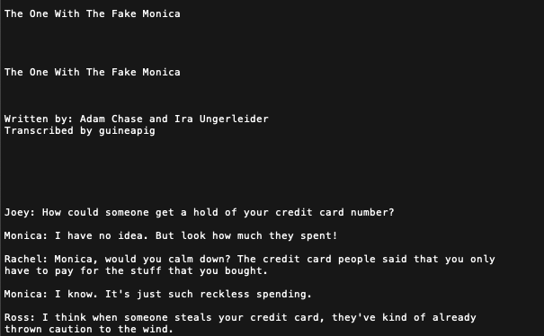
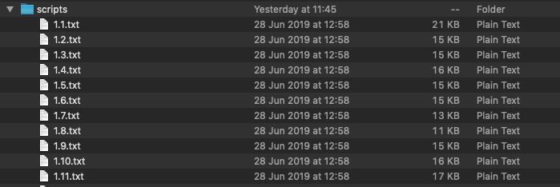
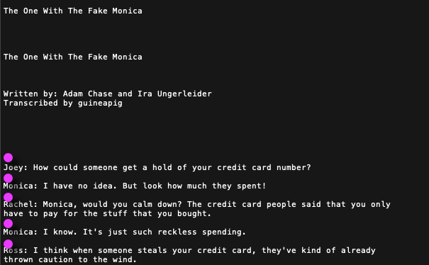

This post will provide an in-depth walkthrough of how to format and export text files into a SQLite database using python. The text files used in this projects contain all scripts from the T.V. show F.R.I.E.N.D.S. and was downloaded from [this repository](https://fangj.github.io/friends/). The aim of this project is to provide a more accessible data set to better serve analysis to be completed in another blog post. 

# Iterating Through Scripts

Each script is a text file containing some information about the episode, the title, writers and transcribers before the script actually starts. We need to find a way to turn a **script** into rows in a database and then work out how to do this for **multiple scripts.** 

{: .align-center}

We will start trying to iterate through the scripts. They are stored in multiple text files and helpfully titled using the format `season.episode`. We can utilise the OS library in python to navigate through our text files. 

{: .align-center}

As it stands, the code below will iterate through all the files in our `scripts` folder to obtain the `filename`. This filename is then split using the `.` separator and those numbers are stored in variables to be appended to the master list. The `master_list` is created as eventually we will want to store the results in a DataFrame.

```python
import os
master_array = [] #append results to array to create data frame

for filename in os.listdir('/scripts/'):
  split_name = filename.split('.') #obtain the season and episodes
  season = split_name[0]   
  episode = split_name[1]
  #TODO method to get each line of the script
  master_array.append([season, episode])
```


# Regular Expressions

Now we know how to move through our FRIENDS files, we need to see how to isolate the lines from each file. To do so I will be using regular expressions, the scripts are quite messy and all formatted differently depending on the transcriber. The pertinent pattern is  `character_name: speech` however this can sometimes span multiple lines. Regular Expressions is like a really powerful `ctrl-F`, they are used to search for patterns in strings, a nice intro on can be found [here](https://medium.com/front-end-weekly/a-practical-beginners-guide-to-regex-regular-expressions-2faccbda117d). The aim of our regular expression is to match the space before our intended line as indicated by the pink dots. We aim to find this space as we can then split the whole file using these positions, giving us groups of character-speech pairs.

{: .align-center}

The regular expression used is shown below. First we mathc the string before a colon `\w+(?=:)`, so now we have "found" the names of each character. However if we want to match the space before we must use `\s`. You can [test it out for yourself](https://regex101.com/r/GFOGbq/2), as you can see in the example, the regular expression also  matches the space before the writers and transcribers, this will need to be removed after. Now we implement the regular expression in python. In the below code we are also able to split the character name and the speech.

```python
script =f.read() #read the script file

pattern = re.compile(r'\s(?=\w+(?=:))') # store the regex
result = re.split(pattern, script) # split the script where our pattern matched (pink dot)

for item in result:
    split_line = item.split(':')
    try:
        character = split_line[0]
        speech = split_line[1]
    except:
        pass
```

This is combined with our loop in the previous section and the `mater_array` is converted to a pandas data frame: 

| **season** | **episode** | **char** | **line**                                         |
| ---------- | ----------- | -------- | ------------------------------------------------ |
| 1          | 23          | Ross     | She's not here yet. She's not here. She's hav... |
| 1          | 23          | Monica   | I'm sure everything's fine. Has her water bro... |
| 1          | 23          | Ross     | I don't know, but when I spoke to her, she sa... |
| 1          | 23          | Joey     | Do we have to know about that?                   |
| 1          | 23          | Monica   | Joey, what are you gonna do when you have a b... |

# Cleaning 

Despite our best efforts, the results are still not 100% ready for analysis. Our first issue is that there are multiple names for each character, this can be seen by executing `sorted(df['char'].unique())`, this will return a list of all unique values in the column. To rectify this takes some manual work which involves looking at the multiple spellings of a certain name, case sensitive! To change the names we use the pandas `replace` method:

```python
# Ensure all names are refering to the correct person
df['char'].replace({'CHAN':'Chandler','CHANDLER':'Chandler', 'Chandlers':'Chandler',
                    'JOEY':'Joey',
                    'MNCA':'Monica','MONICA':'Monica',
                    'PHOE':'Phoebe','PHOEBE':'Phoebe', 'Pheebs':'Phoebe',
                    'Rache':'Rachel','RACHEL':'Rachel', 'RACH':'Rachel',
                    'ROSS':'Ross'},inplace=True)
```

Now we need to address the issues caused by our regular expression, as it caught the authors and transcribers. The format of these lines all end in **by**. Therefore the regular expression takes the last word before the colon as the character name. This means we can drop all of these rows by removing the character **by**. Bye by.

- Written **by**:
- Transcibed **by**:

```python
df = df[df.char != 'by']
```


{: .align-center}

# Sentiment (Again)

Sentiment analysis is on the table when dealing with strings, a more in-depth discussion can be found in a [previous blog post](https://quotennial.github.io/loveisland/). Similar methods are used, for each line in the database a sentiment score is calculated and stored in the `line_sent` column:

```python
df['line_sent'] = df['line'].apply(lambda x: TextBlob(x).sentiment[0])
```

# Export to SQL

Now this may not be a necessary step as most of the SQL commands we would be using could be done using pandas. However, I think sometimes altering different data frame scan sometimes get messy and SQL  language may provide a ore readable way to access this data. Therefore we are now going to move the pandas dataframe into a SQL database. I am using [DB Browser for SQLite](https://sqlitebrowser.org).

```python
import sqlite3
conn = sqlite3.connect('friends_script.db') #connect to the database
df.to_sql('lines', conn, if_exists='replace', index=False) # save into the 'lines' table
```

| season      | episode      | char                 | line        | line_sent               |
| ----------- | ------------ | -------------------- | ----------- | ----------------------- |
| season(int) | episode(int) | Character Name (str) | speech(str) | sentiment score (float) |

Finally our scripts are formatted and placed in a SQL database. Data wrangling in this way can transform raw data into a more useful data set. Even though we are not adding too much to the data set, the different organisational structure can enable a wider breadth of analysis. Now we have the scripts formatted in this way, we can utilise SQL to gain further insights into the show.


  {: .align-center}