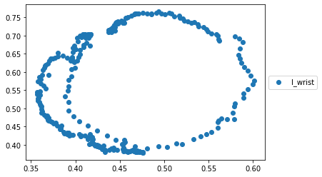
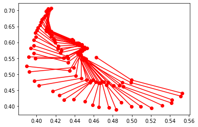
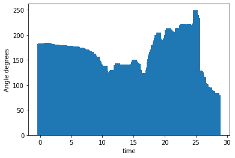

Inspired by an article using the Google Video Intelligence API to [analyse a tennis serve](https://daleonai.com/machine-learning-for-sports), i wanted to see if i could use the Google Video Intelligence API to give me some insight into my golf swing. 

## The API

To work your way round the Google Cloud ecosystem may be a bit confusing at first, [this tutorial series](https://www.youtube.com/watch?v=h1zU0Qor9J8&list=PL3JVwFmb_BnTW_-D0OWrewMvg43_y-Nrm&index=1) shows you everything you need to know to get setup. Google Video Intelligence API is free to use up to a certain point so just watch your billing. The video should help you get your credentials set up, I didn't want to set up the storage bucket so will use the videos from my local files and Google has a really nice [code snippet](https://cloud.google.com/video-intelligence/docs/people-detection) to do that. Eventually you should get to a point where you can list the available features from the `VideoIntelligenceServiceClient`.

```python
[<Feature.FEATURE_UNSPECIFIED: 0>,
 <Feature.LABEL_DETECTION: 1>,
 <Feature.SHOT_CHANGE_DETECTION: 2>,
 <Feature.EXPLICIT_CONTENT_DETECTION: 3>,
 <Feature.FACE_DETECTION: 4>,
 <Feature.SPEECH_TRANSCRIPTION: 6>,
 <Feature.TEXT_DETECTION: 7>,
 <Feature.OBJECT_TRACKING: 9>,
 <Feature.LOGO_RECOGNITION: 12>,
 <Feature.CELEBRITY_RECOGNITION: 13>,
 <Feature.PERSON_DETECTION: 14>]
```

I don't think I did much tutorial-ing there.... but i showed you the places you can find clearer instructions so that's still helpful, right?

## Using the API for my swing

So I used the object detection API first, came back with some great detected objects, including calling me a professional golfer!

```python
{'entity': {'entity_id': '/m/07npwc',
  'description': 'professional golfer',
  'language_code': 'en-US'},
 'category_entities': [{'entity_id': '/m/01g317',
   'description': 'person',
   'language_code': 'en-US'}],
 'segments': [{'segment': {'start_time_offset': {},
    'end_time_offset': {'seconds': 28, 'nanos': 595233000}},
   'confidence': 0.5179229974746704}]}
```

A great confidence boost for a bogey golfer such as myself. To delve deeper into the movement we need to use the PersonDetection feature of the API which is in Beta at time of writing, the code snippets are on [google](https://cloud.google.com/video-intelligence/docs/people-detection) and Dale Markowitz provides a [superb helper function](https://github.com/google/making_with_ml/blob/master/sports_ai/Sports_AI_Analysis.ipynb) that just... works! So now we have a timeline fo where each body part is. 

In practice i used a video of my own swing, but for the purposes of the world wide web I thought [Collin Morikawa's swing](https://www.youtube.com/watch?v=-lOywb34_3U) would be more appropriate and from now on we will be looking at his swing. We can start by plotting the path of the left wrist, that shows us the swing path.



## Visualising it 

To Visualise the swing - use the [Video Intelligence Player package](https://github.com/wbobeirne/video-intelligence-player) and I used FFmpeg (via brew) to convert MOV to mp4.

```bash
brew install ffmpeg
ffmpeg -i morikawa_swing.MOV video.mp4
```

Following the instructions in the repo, `npm start` should give us output like below.

## 

## Elbow angle

Drawing the line between right wrist, right elbow and right shoulder, we can see the angle of the elbow thought the swing. The image below shows the angle change through the start of the downswing sequence.



We can try and put values to this using the function below, putting in our shoulder, elbow and wrist co-ordinates.

```python
import math
 
def getAngle(a, b, c):
    ang = math.degrees(math.atan2(c[1]-b[1], c[0]-b[0]) - math.atan2(a[1]-b[1], a[0]-b[0]))
    return ang + 360 if ang < 0 else ang
```

Now this sort-of works, in the results below we can see how the  shoulder-elbow-wrist stays fairly straight at the beginning of the swing (near 180). The angle then decreases in the backswing as the elbow bends. There is a quick straightening of the elbow as we come into the downswing but then things get funny as the body rotates and the angles seem flipped (250 degree angle!!!).


