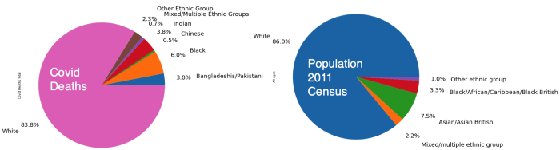
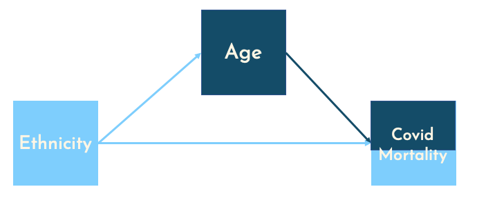

*This article was originally posted on [TDS](https://towardsdatascience.com/impact-of-covid-19-on-the-uk-bame-population-cc09244c5d63?source=friends_link&sk=3320d2532b918603631ea8c2a15be039)*

> *“…the virus knows no race or nationality; it can’t peek at your driver’s license or census form to check whether you are black. Society checks for it, and provides the discrimination on the virus’s behalf.*” — [Game Wood — The Atlantic](https://www.theatlantic.com/ideas/archive/2020/05/we-dont-know-whats-behind-covid-19-racial-disparity/612106/)

Photo by [Samuel Ryde](https://unsplash.com/@samuelryde?utm_source=unsplash&utm_medium=referral&utm_content=creditCopyText) on [Unsplash](https://unsplash.com/?utm_source=unsplash&utm_medium=referral&utm_content=creditCopyText)

There is growing concern that coronavirus has had a [greater impact on people from ethnic minorities](https://www.bhf.org.uk/informationsupport/heart-matters-magazine/news/behind-the-headlines/coronavirus/coronavirus-and-bame-patients). Black, Asian and Minority Ethnic (BAME) communities account for 14% of the population but make up [a third](https://www.theguardian.com/world/2020/apr/07/bame-groups-hit-harder-covid-19-than-white-people-uk) of critically ill coronavirus patients in hospitals is the headline statistic. The [Public Health England report](https://assets.publishing.service.gov.uk/government/uploads/system/uploads/attachment_data/file/892085/disparities_review.pdf) finds that there is a disproportionate impact of Covid-19 on people from all non-white ethnic minorities.

This article compares [excess death statistics](https://github.com/VictimOfMaths/COVID_LA_Plots) with openly available socio-economic data to present a descriptive picture of the situation in England and Wales. Descriptive analysis uses 2011 census data to determine the ethnic mix of local authorities; an approach similar to one [used by the ONS](https://www.ons.gov.uk/peoplepopulationandcommunity/birthsdeathsandmarriages/deaths/articles/coronavirusrelateddeathsbyethnicgroupenglandandwales/2march2020to10april2020). As a result, the unit of observation will be local authorities. A full breakdown of raw data, transformation and analysis can be found and reproduced on GitHub.

> ***Note from the editors:\*** [*Towards Data Science*](http://towardsdatascience.com/) *is a Medium publication primarily based on the study of data science and machine learning. We are not health professionals or epidemiologists, and the opinions of this article should not be interpreted as professional advice. To learn more about the coronavirus pandemic, you can click* [*here*](https://www.who.int/emergencies/diseases/novel-coronavirus-2019/situation-reports)*.*

# What’s going on?

Local Authority Ethnicity share against Excess Deaths [source](https://github.com/Quotennial/covid_bame/blob/master/notebooks/Excess Deaths and Ethnicity.ipynb)

The above plot shows deaths occurring within a Local Authority against the proportional representation of a particular ethnicity in that Local Authority. Lines sloping upwards from left to right indicate that local authorities with higher proportion of BAME population see more excess deaths. Whereas the downward sloping purple line indicates that less ethnically diverse Local Authorities see lower number of excess deaths. It is important to note that data does cluster close to 0, and regression lines [fitted to this kind of clumped data](https://twitter.com/ryxcommar/status/1280268687455457281?s=20) is not evidence of a relationship by itself. This is not measuring the impact to the BAME community directly, but instead comparing geographic areas more negatively affected by the virus, and it’s corresponding ethnic make up.

# Age

Before we look at the location specific factors affecting virus’ impact, we must consider the age of the afflicted, which we understand to be a contributing factor to the mortality of COVID-19. Data published by the ONS contains [counts of coronavirus-related deaths by ethnic group in England and Wales](https://www.ons.gov.uk/peoplepopulationandcommunity/birthsdeathsandmarriages/deaths/datasets/countsandratiosofcoronavirusrelateddeathsbyethnicgroupenglandandwales) and show that 88% of Coronavirus-related deaths are people over 64.

COVID Deaths and Total Population [source](https://github.com/Quotennial/covid_bame/blob/master/notebooks/Ethnicity And Age Breakdown.ipynb)

The figure above shows ethnic breakdown of all recorded covid deaths. Interestingly, this breakdown is fairly similar to the 2011 census statistics which showed a 14% of the population were BAME and the covid data shows that 16.2% of COVID deaths are BAME. There doesn’t seem to be a disproportionate effect on the BAME population.

To square this circle we can use a Dana Mackenzie blog post looking at [race and covid in the USA](http://causality.cs.ucla.edu/blog/index.php/2020/07/06/race-covid-mortality-and-simpsons-paradox-by-dana-mackenzie/) through the Simpsons paradox. Presenting the below causal model, he assumes that ethnicity will influence chances of living to age 65 or older.

This forms a chain, through which the causal effect can pass through. If we are to ask, what is the effect of ethnicity **only** on Covid mortality, then we must hold all other variables constant. It follows that we should control for age and split by age, creating two groups ‘0–64’ and ‘65+’:

Covid Deaths by Ethnicity for different Age Groups [source](https://github.com/Quotennial/covid_bame/blob/master/notebooks/Ethnicity And Age Breakdown.ipynb)

Now we split COVID deaths by age; this shows a similar distribution, for the 65+ category. COVID deaths split by ethnicity roughly match the 2011 census ethnicity breakdown of the UK; 86% of the UK population are white and 85.7% of Covid deaths aged 65+ are also white. However, for the under 65 age bracket, there is a higher share of BAME deaths when compared to the UK population; 30.7% of covid deaths under 64 are from BAME communities, compared to 14% of the population.

Population by Ethnicity for Different Age Groups [source](https://github.com/Quotennial/covid_bame/blob/master/notebooks/Ethnicity And Age Breakdown.ipynb)

Finally, we split the population by ethnicity **and** age, now we can see a clear disparity between ethnicities for both age brackets. Now the BAME population under 65 make up of 30.7% covid deaths but only 14.3% of the population. 2011 census shows that the BAME population make up just 2.3% of the 65+ population, but account for 14.3% of the COVID deaths. This seems to indicate a very disproportionate impact on the BAME population. As shown, [grouping data differently](https://www.youtube.com/watch?v=ebEkn-BiW5k) can lead to different results; assumptions about causal paths are essential when making these grouping decisions.

# Location: Living in Cities

There may be some intrinsic/ biological condition that causes BAME people to be higher risk, but this is probably not the whole story. Poor living environments are well understood to contribute to health risks, recognised in multiple [epidemiological studies](https://www.jstor.org/stable/j.ctt1729vxt). Centric Lab [released a report](https://www.thecentriclab.com/covid-19-poverty-a-london-data-study) taking an in-depth look at human health and urban environments. Economics Observatory also details the mechanisms through which [cities become coronavirus hotspots](https://www.coronavirusandtheeconomy.com/question/why-has-coronavirus-affected-cities-more-rural-areas), including occupational structures. These studies support the causal structure laid out below, where ethnicity will affect location decisions (immigrants settling in dense areas with increased employment opportunities), and these historic location patterns being passed down generations.

To unpack “High Risk Urban Environments”, below is a correlation matrix of area specific attributes obtained using openly available data. Correlations calculated using Spearman’s and p-values shown [here](https://github.com/Quotennial/covid_bame/blob/master/reports/figures/corr_pvals.csv).

Correlation Matrix (Spearman) [source](https://github.com/Quotennial/covid_bame/blob/master/notebooks/Excess Deaths and Ethnicity.ipynb)

- Excess deaths are positively correlated with increased BAME populations, and negatively correlated with increased presence of white ethnic populations. The same pattern we saw in the first scatter plot.
- Co-location of BAME population: Red cluster in the bottom right of the plot indicate co-location of BAME populations. In Local Authorities where there is a high proportion of any ethnic minority, there tends to be a higher proportion of other minorities as well.
- Population density and BAME population: Population density is calculated using [ONS population estimates](https://www.ons.gov.uk/peoplepopulationandcommunity/populationandmigration/populationestimates/datasets/populationestimatesforukenglandandwalesscotlandandnorthernireland) and size of local authority (then cross referenced with [GLA density estimates](https://data.gov.uk/dataset/a76f46f9-c10b-4fe7-82f6-aa928471fcd1/land-area-and-population-density-ward-and-borough)). Showing that BAME ethnicities tend to live in more densely populated areas. When combined with government findings that ethnic minorities [live in cramped housing](https://www.ethnicity-facts-figures.service.gov.uk/housing/housing-conditions/overcrowded-households/latest#by-ethnicity); a picture of dense living for BAME populations emerges.
- Excess deaths negatively correlated with higher number of people over 65, which also tend to be less densely populated and less ethnically diverse.
- Portion Furloughed and the Index of Multiple Deprivation: Neither metrics show any real indication of a relationship.

So far, we have only seen correlations that may give us a profile of the kind of high-risk local authorities. No fancy modelling or weighted metrics used so far, this follows from a [piece Tom Forth wrote](https://www.tomforth.co.uk/coronavirusanddeprivation2/) about useful statistics and misleading metrics. He studies an adjacent concern — that most deprived areas are worse affected — but finds no evidence. I also find no strong relationship between deprivation and excess deaths. But Tom also highlights an important point about the social-justice element; BAME people are being affected but to uncover the real underlying factors — we must be unbiased in our analysis, not go trying to fit the data into our beliefs and hold our assumptions loosely.

Thus far data collection has been prioritised for monitoring, this can be an issue when trying to uncover causal links in “real time”; the 2011 census data is a year away from being officially outdated. Data being collected and published about Coronavirus is an ongoing, iterative process; collection methods and data quality can change weekly. For example; the [omission of pillar II testing](https://www.inyourarea.co.uk/news/why-the-coronavirus-figures-you-see-on-inyourarea-increased-so-much/) shows us how drastically the “data” can shift. Chris Giles of the FT compares the new [speedy economic data to fast food](https://www.ft.com/content/366653da-fc7b-4f3d-bf2f-ef95dfc18041) — tempting but bad for you. Reliance on data without understanding the causal structure can be misleading.

# Geospatial Analysis

There has been no shortage of COVID map-dashboards; spatial analysis has been an [important tool](https://www.wired.co.uk/article/uk-lockdown) in trying to contain and reduce the spread. The map below uses local Moran’s statistic which is: “the correlation coefficient for the relationship between a variable (like excess deaths) and its surrounding values” [[ref](https://mgimond.github.io/Spatial/spatial-autocorrelation.html#local-morans-i)]. We use this measure to compare excess death rates of local authorities with neighbouring local authorities.

Excess Deaths using Local Moran’s Statistic [source](https://github.com/Quotennial/covid_bame/blob/master/notebooks/spatial_analysis.ipynb)

The scatter plot on the left visualises the local authorities and relationship with their neighbours, coloured dots are statistically significant to p=0.05. The top right red quadrant shows that LA with high number of excess deaths are surrounded by other LA with similarly high excess deaths. Whereas the bottom left blue quadrant shows low excess deaths surrounded by other LA with low excess deaths.

On the map red areas indicate “covid hotspots”, we see a London cluster of local authorities and regions around Liverpool and Manchester highlighted as high number of excess deaths with similarly high neighbours. There is also a cluster near Leicester and Birmingham where a local lockdown was put in place.

# Conclusion

The correlation matrix indicates the co-location of BAME population in dense areas and the spatial analysis shows the correlation of high excess deaths in urban areas — pointing towards the city’s role in increasing COVID alongside more BAME people living in cities. However, this reasoning ignores the inequality and polarisation within cities. Cities are where very different socio-economic groups live side by side. Analysis and policy solely focused on regions as a whole will miss these differences and more granular data would benefit this effort.

In uncertain times such as these, we often seek data to cling onto and provide some certainty; but more data about our world does not necessarily mean we understand more about our world. Complex models and machine learning won’t cleanse the data of errors and omitted testing numbers — but reinforce them. This has been a first run at trying to understand the impacts of COVID on BAME population in the UK.

In the meantime, the code and data (raw and clean) is all [online](https://github.com/Quotennial/covid_bame). I am aware the statistical methods used are quite simple and believe that this will help communicate the picture better than hiding meaning (and my mistakes!) behind complex modelling and caveats. Sometimes simplicity can provide more clarity than complex modelling approaches, and in these uncertain times, clarity is in short supply.