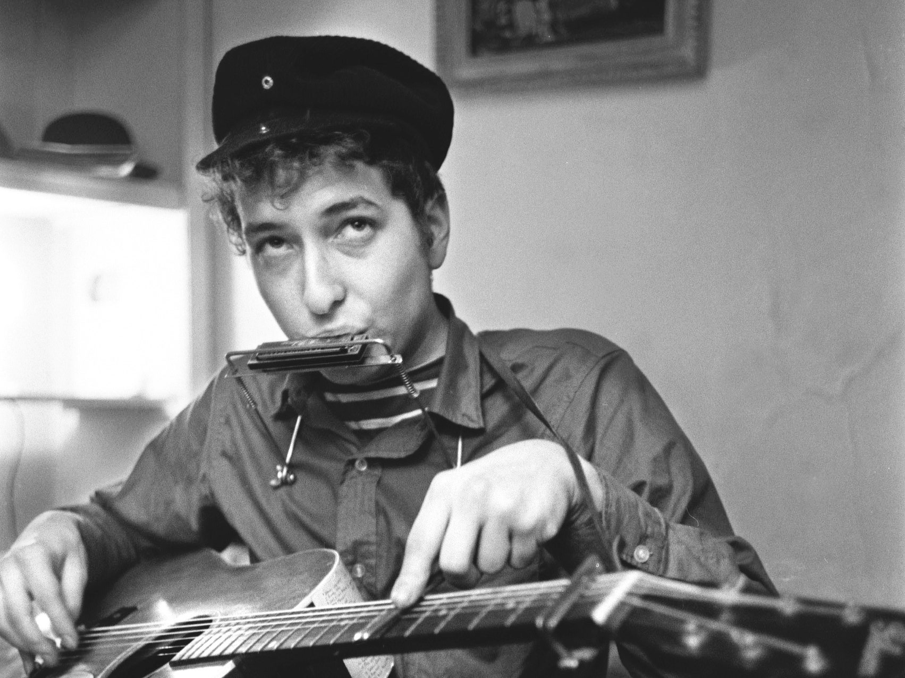
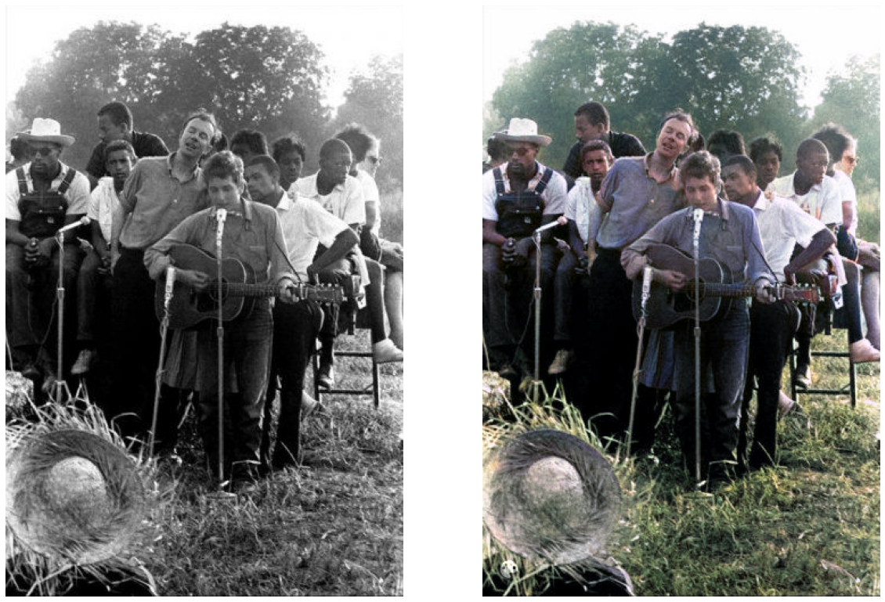
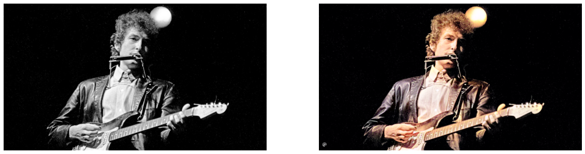
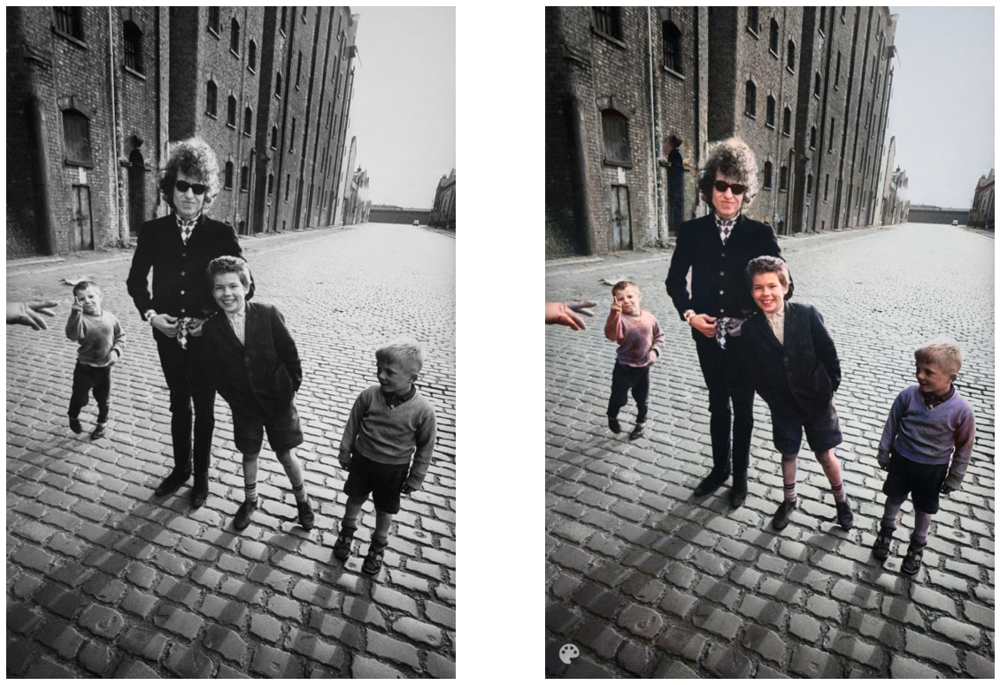
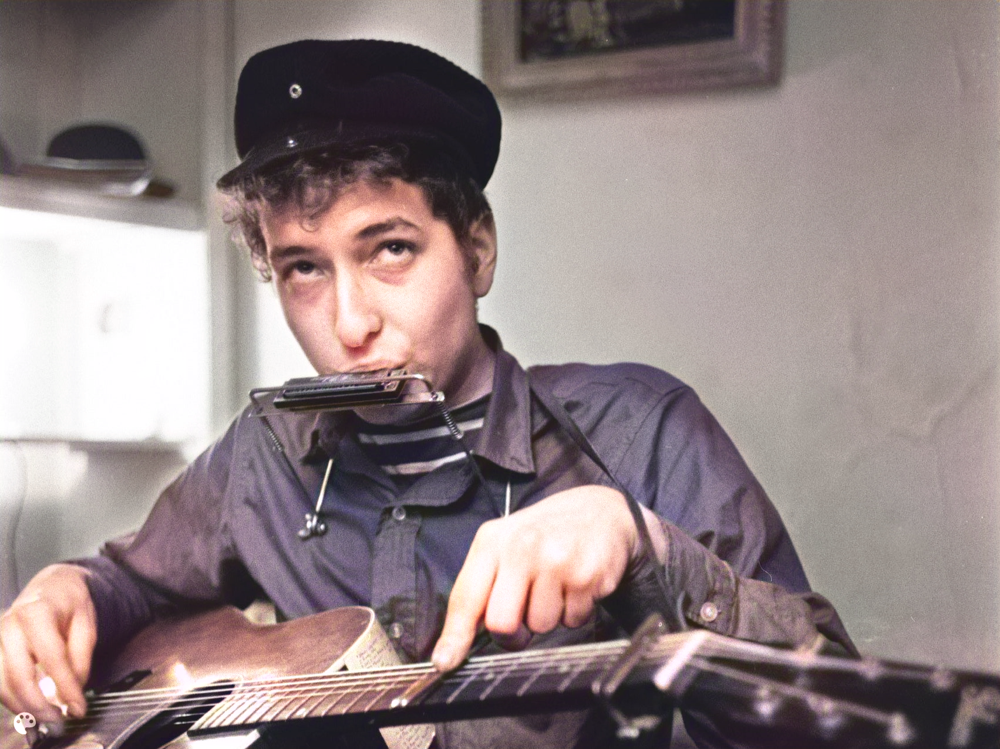

Bob Dylan is one of my favourite artists and recently i've been looking a bit into his life and how wrote some of the most iconic songs ever. Theres a couple of documentaries about his life, [No Direction Home](https://en.wikipedia.org/wiki/No_Direction_Home) and the half fiction [Rolling Thunder Revue](https://en.wikipedia.org/wiki/Rolling_Thunder_Revue:_A_Bob_Dylan_Story_by_Martin_Scorsese) both directed by Martin Scorsese. And there's a couple of ones on YouTube like [Don't Look Back](https://www.youtube.com/watch?v=-94ydQGO1AA).

A journey back into Bob Dylan's life is as much about his life events as it is about key events in American history, such as the [Cuban Missile Crisis](https://en.wikipedia.org/wiki/A_Hard_Rain%27s_a-Gonna_Fall) and the [Civil Rights Movement](https://en.wikipedia.org/wiki/Only_a_Pawn_in_Their_Game). It's also a look back at the progression of technology such as the infamous introduction of the electric guitar at the [Newport Folk Festival](https://youtu.be/6x608XzG9Hw).

Improvements in photograph technology is also clear to see through Dylans life. In the early Woody Guthrie days there are black and white still images, and some silent clips of Dylan in NewYork. As he became more well known there are some black and white videos with sound, including lots of footage of the tour of the UK.   I personally find it hard to imagine colour in historic black and white photos - I find it so difficult to imagine the world around the photo being in colour too. I saw [this Vox piece](https://www.youtube.com/watch?v=vubuBrcAwtY) about how much contextual information goes into colourising photos and the results are quite impressive.

Anyway, I came across [deoldify.ai](https://deoldify.ai), a project using Generative adversarial network approach to re-colourising black and white images. GANs approach is quite cool as it uses 2 neural networks pitted against each other, where one tries to fool the other by generating fake data that it tries to pass off as real. The **generator** neural network creates the fake data, this is mixed with real data and fed to the **discriminator** who tries to differentiate between real and fake data. This feedback loop then allows the generator to improve it's performance on generating fake data. As always, there is **so much more** to this deep learning method, Computerphile has a good [video on it](https://youtu.be/Sw9r8CL98N0). 

Hopefully you could see how this method would be pretty applicable to this use case: We're training an algorithm to create a fake picture (colourised) that should pass off for a real one. DeOldify have setup a really clear [repo](https://github.com/jantic/DeOldify#about-deoldify) to help anyone colourise their images (or videos). You could either clone the repo or use the google [collab](https://colab.research.google.com/github/jantic/DeOldify/blob/master/ImageColorizerColab.ipynb) notebook, which removes the dependency hassle and also useful if you haven't got the required hardware.

Bob Dylan and Pete Seeger in Mississippi 1963 [source](https://i.pinimg.com/originals/97/b8/bc/97b8bc918ef4c32ccbc9eb3e57d9a3f1.jpg)

Dylan Playing the Electric Guitar at the Newport Folk festival 1965 [source](https://media.npr.org/assets/img/2015/07/21/26_dge_wide-0de020d2a762b70974171405e89afc977be9522a.jpg?s=1400)

Bob Dylan in Liverpool 1966 [source](https://www.morrisonhotelgallery.com/photographs/bIjAIO/Bob-Dylan-Liverpool-England-1966)

There is an interesting discussion on wether we should be colourising photos and if it could be [Rewriting History](https://paleofuture.gizmodo.com/are-colorized-photos-rewriting-history-1579276696), especially he algorithmically driven kind of colourising. We know that images and algorithms have a [problem with bias](https://www.bbc.com/news/technology-54234822) so should be careful to involve experts such as those shown in the Vox explainer - where a lot of work goes into gaining lots of contextual information and verify the evidence before colourising. But for some small projects and maybe family photos, tools such as this make colourising much more accessible and the DeOldify project is makes it very accessible. DeOlidfy also have a very impressive video colourisation solution that [looks very good](https://youtu.be/o8dzxh7Ybqw). 

If you’ve got any artists or videos or old black-and-white images you’d like to see in colour then why not give DeOldify a go!  My grandma has asked me to do some Elvis photos next so I’ll be focusing on that.

